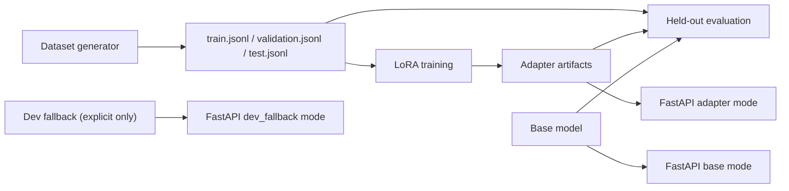

# LLM-Finetune-Service

`LLM-Finetune-Service` is a lightweight, portfolio-focused applied ML project for one narrow task: rewriting formal enterprise emails into concise Slack-style messages using supervised fine-tuning and LoRA adapters.

The repo is designed to show real fine-tuning capability rather than prompt-only scaffolding:

- deterministic dataset generation with train/validation/test splits
- a real LoRA training path built on Hugging Face `transformers` and `peft`
- held-out evaluation that compares base-model output to adapter output
- a FastAPI service that can run in `base`, `adapter`, or explicit `dev_fallback` mode
- documentation that is honest about what was and was not executed in the current environment

This repository currently ships as a training-ready project. It does **not** claim that a real adapter was trained inside this workspace, because the local environment is Python `3.14.3` and the supported stack for this project is Python `3.11` or `3.12`.

## Why this task

Enterprise teams write updates in a formal email register, but operational communication often happens in Slack. Fine-tuning on this translation task is small enough to run locally, concrete enough to evaluate, and realistic enough to demonstrate data prep, LoRA training, evaluation, and serving discipline.

## What this repo demonstrates

- Building a synthetic-but-structured supervised dataset for a business communication task
- Converting raw task records into instruction-tuning prompts
- Training LoRA adapters on top of a local-friendly base model
- Comparing baseline vs fine-tuned generations on a held-out split
- Packaging the model behind a transparent API

## Architecture



Core package layout:

- `src/llm_finetune_service/data`: dataset generation and validation
- `src/llm_finetune_service/training`: prompt formatting and LoRA training
- `src/llm_finetune_service/eval`: evaluation metrics and report generation
- `src/llm_finetune_service/inference`: runtime model loading and caching
- `src/llm_finetune_service/api`: FastAPI application

## Supported environment

- Python `>=3.11,<3.13`
- Poetry for dependency management
- Optional Redis for caching
- Recommended for real training:
  - Apple Silicon with MPS or a CUDA GPU
  - enough disk for a Hugging Face base model and adapter artifacts

## Quickstart

```bash
poetry env use 3.11
poetry install

make data
make validate-data
make data-preview
```

Build, train, evaluate, serve:

```bash
make train
make eval
make serve-base
make serve-adapter
```

Explicit development-only fallback mode:

```bash
make serve-dev
```

## Dataset pipeline

The dataset is generated deterministically from structured scenario templates. Each record contains:

- `id`
- `split`
- `scenario_type`
- `instruction`
- `source_email`
- `target_slack`
- `metadata`

Default dataset size is `480` examples across scenario families such as:

- status updates
- escalations
- meeting requests
- approvals and declines
- feedback and clarifications
- incidents
- vendor coordination
- leadership updates
- recruiting
- finance operations

The split strategy is deterministic and group-based so that similar examples do not leak between train and evaluation splits.

## Training approach

The training path uses:

- base model: `TinyLlama/TinyLlama-1.1B-Chat-v1.0`
- prompt format: instruction + source email + target Slack message
- PEFT LoRA adapters
- Hugging Face `Trainer`

Training outputs are written to:

```text
artifacts/train_runs/<run_id>/
├── adapter/
├── environment.json
├── metrics.json
├── sample_predictions.json
└── train_config.json
```

The training script does **not** fabricate adapters if training fails. If training cannot run, it fails with an actionable error.

## Evaluation methodology

Evaluation compares:

- base model output
- adapter output

on the held-out `test.jsonl` split.

Metrics are heuristic and task-specific:

- style conformity
- brevity / compression
- action preservation
- Slack-likeness
- lexical divergence from the source

Outputs are saved to:

```text
artifacts/eval/<run_id>/
├── results.json
└── report.md
```

No benchmark numbers are checked in unless generated by a real run.

A real short-run evaluation from this repository is documented in [docs/evaluation_report.md](/Users/mohit/llm-finetune-service/docs/evaluation_report.md).

## Serving and API

Runtime modes:

- `base`: base model only
- `adapter`: base model plus LoRA adapter
- `dev_fallback`: deterministic rule-based mode for local development only

`POST /generate` response:

```json
{
  "generated_text": "Quick update: rollout is looking good and the team wrapped final checks.",
  "mode": "base",
  "model_name": "TinyLlama/TinyLlama-1.1B-Chat-v1.0",
  "adapter_loaded": false,
  "cached": false,
  "latency_ms": 142
}
```

`GET /health` reports the active mode, adapter state, and cache backend.

## Example transformation

**Source email**

> I am writing to inform you that the vendor confirmed a delay in delivery and asked for revised implementation dates. This affects leadership and should stay visible in the weekly update. Please confirm next steps by EOD Friday. Thank you for your attention to this matter.

**Target Slack**

> Vendor update: the vendor is delayed and asked for updated implementation dates. Can someone confirm next steps by EOD Friday?

More examples live in [docs/sample_transformations.md](/Users/mohit/llm-finetune-service/docs/sample_transformations.md).

## Reproducibility

See:

- [docs/reproducibility.md](/Users/mohit/llm-finetune-service/docs/reproducibility.md)
- [docs/architecture.md](/Users/mohit/llm-finetune-service/docs/architecture.md)
- [docs/model_card.md](/Users/mohit/llm-finetune-service/docs/model_card.md)

## Limitations

- The dataset is synthetic and should be treated as a demonstration corpus, not production supervision.
- Eval metrics are heuristics; they are useful for regression detection, not as universal quality truth.
- Adapter quality depends heavily on the environment, base model download, and training budget.
- This repo is intentionally local-friendly, so it favors portability over maximum performance.

## Future improvements

- add preference tuning or pairwise ranking on top of the supervised stage
- add a small human review set
- compare multiple small base models under the same evaluation harness
- add richer preservation checks for entities, deadlines, and ask clarity
